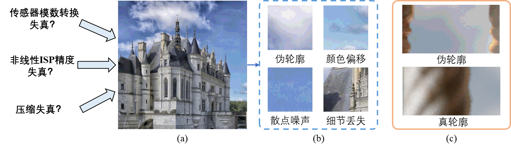

# Bit Deep Enhancement 

> **Authors:**
> [Jing Liu](https://github.com/TJUMMG).

## Table of Contents
- [Bit Deep Enhancement ](#bit-deep-enhancement-)
		- [Table of Contents](#table-of-contents)
	- [Introduction](#introduction)
	- [Datasets](#datasets)
	- [Papers and Codes](#papers-and-codes)
		- [Image Domain](#image-domain)
		- [Video Domain](#video-domian)

## Introduction
The last decade has witnessed a growing interest in video salient object detection (VSOD). However, the research community long-term lacked a well-established VSOD dataset representative of real dynamic scenes with high-quality annotations. To address this issue, we elaborately collected a visual-attention-consistent Densely Annotated VSOD (DAVSOD) dataset, which contains 226 videos with 23,938 frames that cover diverse realistic-scenes, objects, instances and motions. With corresponding real human eye-fixation data, we obtain precise ground-truths. This is the first work that explicitly emphasizes the challenge of saliency shift, i.e., the video salient object(s) may dynamically change. To further contribute the community a complete benchmark, we systematically assess 17 representative VSOD algorithms over seven existing VSOD datasets and our DAVSOD with totally ~84K frames (largest-scale). Utilizing three famous metrics, we then present a comprehensive and insightful performance analysis. Furthermore, we propose a baseline model. It is equipped with a saliencyshift-aware convLSTM, which can efficiently capture video saliency dynamics through learning human attention-shift behavior. Extensive experiments1 open up promising future directions for model development and comparison.

      
    <em> 
    Figure 1: Overall architecture of the proposed model.
    </em>

## Datasets

&nbsp; &nbsp; 位深增强算法的设计和验证离不开高位深内容数据库，目前国内外常用的高位深图像和视频数据集有Sintel数据集、MIT-Adobe 5K数据集、TESTIMAGES数据集、FuntHDR数据集、SJTU HDR、Tears of Steel数据集、SVT数据集。
   |**Year**|**Dataset**|**Resolution**|**High Bit**|**Low Bit**|**Frame rate**|**Download Link**|**Description**|
   | :-: | :-: | :-: | :-: |:-: | :-: | :-: | :- |
   |2012|**Sintel**|1K,2K,4K|16|8|24|[Link](http://sintel.is.tue.mpg.de/downloads)|计算机合成的动画电影,具有细腻平滑的内容纹理包含各种动植物、建筑物、自然场景以及极端亮暗情况|
   |2011|**MIT-Adobe5K**|-|16|-|-|[Link](https://data.csail.mit.edu/graphics/fivek/)|不同摄影者使用不同品牌相机拍摄的自然图像集涵盖多种人物、动植物、建筑物等自然场景，包括多种不同的照明条件和多种分辨率。经专业调色的HDR图像保存为相机原始格式|
   |2014|**TESTIMAGES**|100×100至2400×2400|16|8|-|[Link](https://sourceforge.net/projects/testimages/files/)|用于显示设备或图像处理技术的分析和质量评估其中包含40张实际拍摄的自然图像，8bit图像由16bit图像通过亮度归一化生成|
   |2010|**Funt HDR**|2142×2142|16|-|-|[Link](https://www2.cs.sfu.ca/~colour/data/funt_hdr/#DESCRIPTION)|使用NikonD700数码静物相机拍摄的105个场景每个场景包含9个不同曝光值。包含raw数据格式和16bit PNG格式，经过MATLAB图像处理工具箱生成HDR图像|
   |2016|**SHTU HDR**|4K|16|-|60|[Link](https://medialab.sjtu.edu.cn/post/16-01-01-sjtu-hdr-video-sequences/)|SonyF65、F55相机拍摄的16个超高清HDR视频集|
   |2013|**Tears of Steel**|2K,4K|16|8|24|[Link](https://mango.blender.org/download/)|自然场景与计算机合成混合的电影序列|
   |2014|**SVT**|4K|16|-|50|[Link](https://tc11.cvc.uab.es/datasets/SVT_1)|视频质量专家组(VQEG)发布的4K测试剪辑|

&nbsp; &nbsp; 除上述高位深数据库以外，由于传统8bit图像数据库内容丰富、更符合早期降质等原因，也可用于验证位深增强算法的有效性，经典的8bit数据库主要包括：Kodak、DPED、ADE20K、OST300等。

   |**Year**|**Dataset**|**Number**|**Download Link**|**Description**|
   | :-: | :-: | :-: | :-: | :- |
   |1999|**Kodak**|24|[Link](https://r0k.us/graphics/kodak/)|经典的无损真彩图像数据库，由Eastman Kodak公司发布|
   |2017|**DPED**|16K|[Link](https://pan.baidu.com/s/1Czyd6oG4VxXBSsZDCCWapw#list/path=%2F)(57l9 )|由三部智能手机和一台数码单反相机在野外同步拍摄的照片组成，每张由智能相机拍摄的图片都有对应的各种不同且复杂的降质图片|
   |2019|**ADE20K**|25M|[Link](https://groups.csail.mit.edu/vision/datasets/ADE20K/)|从多个早期的数据集中收集得到的真实复杂场景图片(如道路，树林等)，最初用于场景感知和语义理解等任务。由于存在不同程度的拍摄读取噪声、网络传输压缩损失等多种降质，也可用于面向实际场景的增强任务|
   |2010|**Funt HDR**|105个场景|[Link](https://www2.cs.sfu.ca/~colour/data/funt_hdr/#DESCRIPTION)|使用NikonD700数码静物相机拍摄的105个场景，每个场景包含9个不同曝光值。包含raw数据格式和16bitPNG格式，经过MATLAB图像处理工具箱生成HDR图像|
   |2016|**SJTU HDR**|600帧×16序列|[Link](https://medialab.sjtu.edu.cn/post/16-01-01-sjtu-hdr-video-sequences/)|SonyF65、F55相机拍摄的16个超高清HDR视频集|
   |2013|**Tears of Steel**|17620|[Link](https://mango.blender.org/download/)|自然场景与计算机合成混合的电影序列|
   |2014|**SVT**|1517|[Link](https://tc11.cvc.uab.es/datasets/SVT_1)|视频质量专家组(VQEG)发布的4K测试剪辑|

## Papers and Codes

- ### Image Domain

   - [IFTC 2017]:boom: **Bit-Depth Enhancement via Convolutional Neural Network.** &nbsp; *Jing Liu* , BE-CNN.\
[[Website](https://link.springer.com/chapter/10.1007/978-981-10-8108-8_24)] [[Code](https://github.com/TJUMMG/BE-CNN)] 

   - [ACCV 2018]:boom: **BitNet: Learning-Based Bit-Depth Expansion.** &nbsp; *Junyoung Byun* , BitNet.\
[[Website](https://link.springer.com/chapter/10.1007/978-3-030-20890-5_5)] [[Code](https://github.com/kamkyu94/BitNet)] 

   - [ACCV 2018]:boom: **Gradient-Guided DCNN for Inverse Halftoning and Image Expanding.** &nbsp; *Yi Xiao* , GG-DCNN.\
[[Website](https://link.springer.com/chapter/10.1007/978-3-030-20870-7_13)]

   - [ACCV 2018]:boom: **BE-CALF: Bit-Depth Enhancement by Concatenating All Level Features of DNN.** &nbsp; *Jing Liu* , BE-CALF.\
[[Website](https://ieeexplore.ieee.org/document/8713480)] [[Code](https://github.com/TJUMMG/BE-CALF)] 

   - [Neucom 2019]:boom: **Photo-realistic image bit-depth enhancement via residual transposed convolutional neural network.** &nbsp; *Yuting Su* , RT-CNN.\
[[Website](https://www.sciencedirect.com/science/article/pii/S0925231219305272)] 

   - [TIP 2019]:boom: **Deep reconstruction of least significant bits for bit-depth expansion.** &nbsp; *Yang Zhao* , BDEN\
[[Website](https://ieeexplore.ieee.org/document/8603810)] 

   - [TCSVT 2020]:boom: **Lighter but efficient bit-depth expansion network.** &nbsp; *Yang Zhao* , LBDE\
[[Website](https://ieeexplore.ieee.org/document/9044324)] 

   - [Arxiv 2020]:boom: **Deep attentive generative adversarial network for photo-realistic image de-quantization.** &nbsp; *Yang Zhang* , DAGAN\
[[Website](https://arxiv.org/ftp/arxiv/papers/2004/2004.03150.pdf)] 

   - [TCSVT 2021]:boom: **Residual-Guided Multiscale Fusion Network for Bit-Depth Enhancement.** &nbsp; *Jing Liu* , RMFNet\
[[Website](https://ieeexplore.ieee.org/document/9491068)] [[Code](https://github.com/TJUMMG/RMFNet)] 

   - [Displays 2021]:boom: **Photo-realistic residual bit-depth enhancement by advanced conditional GAN.** &nbsp; *Jing Liu* , BE-ACGAN\
[[Website](https://www.sciencedirect.com/science/article/pii/S0141938221000512)] [[Code](https://github.com/TJUMMG/BE-ACGAN)] 

   - [TPAMI 2022]:boom: **A Path to the Variational Diffusion Loss.** &nbsp; *Alex Alemi* , ALBM\
[[Website](https://blog.alexalemi.com/diffusion.html)] [[Code](https://colab.research.google.com/github/google-research/vdm/blob/main/colab/SimpleDiffusionColab.ipynb)] 

   - [CVPR 2022]:boom: **A Path to the Variational Diffusion Loss.** &nbsp; *Alex Alemi* , LSRRD\
[[Website](https://blog.alexalemi.com/diffusion.html)] [[Code](https://colab.research.google.com/github/google-research/vdm/blob/main/colab/SimpleDiffusionColab.ipynb)] 

   - [TCSVT 2023]:boom: **A Path to the Variational Diffusion Loss.** &nbsp; *Alex Alemi* , FBDN\
[[Website](https://blog.alexalemi.com/diffusion.html)] [[Code](https://colab.research.google.com/github/google-research/vdm/blob/main/colab/SimpleDiffusionColab.ipynb)] 

- ### Video Domian

   - [TMM 2019]:boom: **Spatiotemporal symmetric convolutional neural network for video bit-depth enhancement.** &nbsp; *Jing Liu* , SSCNN\
[[Website](https://ieeexplore.ieee.org/document/8636159)] 

   - [TMM 2021]:boom: **Tanet: Target attention network for video bit-depth enhancement.** &nbsp; *Jing Liu* , TANet\
[[Website](https://ieeexplore.ieee.org/abstract/document/9547837)] [[Code](https://colab.research.google.com/github/google-research/vdm/blob/main/colab/SimpleDiffusionColab.ipynb)] 

   - [BMSB 2021]:boom: **3D-BitNet: Flow-agnostic and precise network for video bit-depth expansion.** &nbsp; *Geyingjie Wen* , 3D-BitNet\
[[Website](https://ieeexplore.ieee.org/document/9547086)]

   - [MMSP 2022]:boom: **Bit-depth enhancement detection for compressed video.** &nbsp; *Nickolay Safonov* , ????\
[[Website](https://arxiv.org/abs/2211.04799v1)] [[Code](https://colab.research.google.com/github/google-research/vdm/blob/main/colab/SimpleDiffusionColab.ipynb)] 

---
Note that: This is the test version written by wjx.

---

Contact: Jing Liu (jliu_tju@tju.edu.cn).

[⬆ back to top](#headin)
